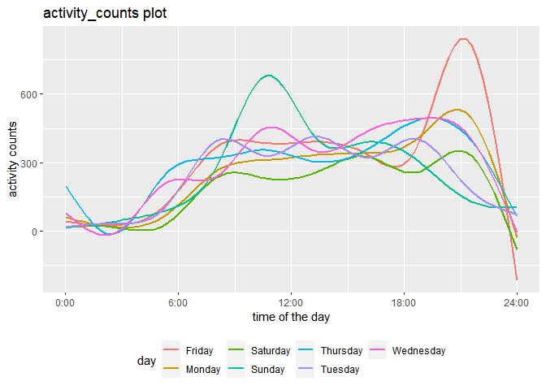

p8105_hw3_al4225
================
Anjing
2022-10-10

``` r
library(tidyverse)
```

    ## ── Attaching packages ─────────────────────────────────────── tidyverse 1.3.2 ──
    ## ✔ ggplot2 3.3.6      ✔ purrr   0.3.4 
    ## ✔ tibble  3.1.8      ✔ dplyr   1.0.10
    ## ✔ tidyr   1.2.0      ✔ stringr 1.4.1 
    ## ✔ readr   2.1.2      ✔ forcats 0.5.2 
    ## ── Conflicts ────────────────────────────────────────── tidyverse_conflicts() ──
    ## ✖ dplyr::filter() masks stats::filter()
    ## ✖ dplyr::lag()    masks stats::lag()

## Problem 2

### Wrangling

Load, tidy, and otherwise wrangle the data. Your final dataset should
include all originally observed variables and values; have useful
variable names; include a weekday vs weekend variable; and encode data
with reasonable variable classes. Describe the resulting dataset
(e.g. what variables exist, how many observations, etc).

There are 50400 observations and 6 variables. Each observation
represents the activity counts for each minute of a 24-hour day starting
at midnight in the day of given week. There are some key variables such
as week, day_id, day, day_type and activity_minute and activity_counts.

``` r
accel_data = read_csv("./data/accel_data.csv",
                col_names = TRUE) %>%
  janitor::clean_names() %>%
  drop_na() %>%
  mutate(
    day_type = ifelse(day %in% c("Saturday", "Sunday"), "weekday", "weekend")) %>%
  group_by(week,day_id) %>%
  pivot_longer(
    activity_1:activity_1440, 
    names_to = "activity_minute", 
    values_to = "activity_counts",
    names_prefix = "activity_") %>%
  mutate(
    activity_counts = round(activity_counts, digits = 0),
    activity_minute = as.integer(activity_minute)) %>%
    select(week, day_id, day, day_type, everything())
```

    ## Rows: 35 Columns: 1443
    ## ── Column specification ────────────────────────────────────────────────────────
    ## Delimiter: ","
    ## chr    (1): day
    ## dbl (1442): week, day_id, activity.1, activity.2, activity.3, activity.4, ac...
    ## 
    ## ℹ Use `spec()` to retrieve the full column specification for this data.
    ## ℹ Specify the column types or set `show_col_types = FALSE` to quiet this message.

``` r
nrow(accel_data)
```

    ## [1] 50400

``` r
ncol(accel_data)
```

    ## [1] 6

``` r
accel_data
```

    ## # A tibble: 50,400 × 6
    ## # Groups:   week, day_id [35]
    ##     week day_id day    day_type activity_minute activity_counts
    ##    <dbl>  <dbl> <chr>  <chr>              <int>           <dbl>
    ##  1     1      1 Friday weekend                1              88
    ##  2     1      1 Friday weekend                2              82
    ##  3     1      1 Friday weekend                3              64
    ##  4     1      1 Friday weekend                4              70
    ##  5     1      1 Friday weekend                5              75
    ##  6     1      1 Friday weekend                6              66
    ##  7     1      1 Friday weekend                7              54
    ##  8     1      1 Friday weekend                8              48
    ##  9     1      1 Friday weekend                9              55
    ## 10     1      1 Friday weekend               10              43
    ## # … with 50,390 more rows

### Table for total activity

Traditional analyses of accelerometer data focus on the total activity
over the day. Using your tidied dataset, aggregate across minutes to
create a total activity variable for each day, and create a table
showing these totals. Are any trends apparent?

According to the table, we can see that there are 35 total activity
counts in 35 days. From week1 to week3, the total activity counts
maintain a high level and gradually increase from week1 to week2. From
week3 to week5, the total activity counts tend to decrease especially on
Saturday.

``` r
accel_data %>%
  group_by(week, day_id, day) %>%
  summarize(activity_total = sum(activity_counts)) %>%
  knitr::kable()
```

    ## `summarise()` has grouped output by 'week', 'day_id'. You can override using
    ## the `.groups` argument.

| week | day_id | day       | activity_total |
|-----:|-------:|:----------|---------------:|
|    1 |      1 | Friday    |         480534 |
|    1 |      2 | Monday    |          78830 |
|    1 |      3 | Saturday  |         376254 |
|    1 |      4 | Sunday    |         631105 |
|    1 |      5 | Thursday  |         355948 |
|    1 |      6 | Tuesday   |         307103 |
|    1 |      7 | Wednesday |         340113 |
|    2 |      8 | Friday    |         568839 |
|    2 |      9 | Monday    |         295431 |
|    2 |     10 | Saturday  |         607175 |
|    2 |     11 | Sunday    |         422018 |
|    2 |     12 | Thursday  |         474048 |
|    2 |     13 | Tuesday   |         423245 |
|    2 |     14 | Wednesday |         440962 |
|    3 |     15 | Friday    |         467420 |
|    3 |     16 | Monday    |         685910 |
|    3 |     17 | Saturday  |         382928 |
|    3 |     18 | Sunday    |         467052 |
|    3 |     19 | Thursday  |         371230 |
|    3 |     20 | Tuesday   |         381507 |
|    3 |     21 | Wednesday |         468869 |
|    4 |     22 | Friday    |         154049 |
|    4 |     23 | Monday    |         409450 |
|    4 |     24 | Saturday  |           1440 |
|    4 |     25 | Sunday    |         260617 |
|    4 |     26 | Thursday  |         340291 |
|    4 |     27 | Tuesday   |         319568 |
|    4 |     28 | Wednesday |         434460 |
|    5 |     29 | Friday    |         620860 |
|    5 |     30 | Monday    |         389080 |
|    5 |     31 | Saturday  |           1440 |
|    5 |     32 | Sunday    |         138421 |
|    5 |     33 | Thursday  |         549658 |
|    5 |     34 | Tuesday   |         367824 |
|    5 |     35 | Wednesday |         445366 |

``` r
accel_data
```

    ## # A tibble: 50,400 × 6
    ## # Groups:   week, day_id [35]
    ##     week day_id day    day_type activity_minute activity_counts
    ##    <dbl>  <dbl> <chr>  <chr>              <int>           <dbl>
    ##  1     1      1 Friday weekend                1              88
    ##  2     1      1 Friday weekend                2              82
    ##  3     1      1 Friday weekend                3              64
    ##  4     1      1 Friday weekend                4              70
    ##  5     1      1 Friday weekend                5              75
    ##  6     1      1 Friday weekend                6              66
    ##  7     1      1 Friday weekend                7              54
    ##  8     1      1 Friday weekend                8              48
    ##  9     1      1 Friday weekend                9              55
    ## 10     1      1 Friday weekend               10              43
    ## # … with 50,390 more rows

### Graph

Accelerometer data allows the inspection activity over the course of the
day. Make a single-panel plot that shows the 24-hour activity time
courses for each day and use color to indicate day of the week. Describe
in words any patterns or conclusions you can make based on this graph.

Description: 1.There are two evident peaks in the plot which are at
21:00 on Friday and during 9:00 to 12:00 on Sunday.  
2.The activity counts are higher on Friday and Sunday so this 63
year-old male with BMI 25 prefers to do the activity on Friday and
Sunday. 3.The activity counts decline from 21:00 to 3:00 the next day
and they increase from 3:00 to 21:00. It means that the man tends to
have a rest after 21:00.

``` r
accel_data %>%
  ggplot(aes(x = activity_minute, y = activity_counts, color = day)) + 
  geom_smooth(se = FALSE) +
  labs(
    title = "activity_counts plot",
    x = "time of the day",
    y = "activity counts"
  ) +
  scale_x_continuous(
    breaks = c(0, 360, 720, 1080, 1440), 
    labels = c("0:00", "6:00", "12:00","18:00", "24:00" )
  ) +
  theme(legend.position = "bottom")
```

    ## `geom_smooth()` using method = 'gam' and formula 'y ~ s(x, bs = "cs")'

<!-- -->

## Problem 3
