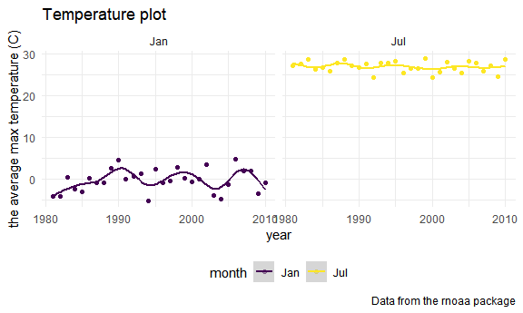

p8105_hw3_al4225
================
Anjing
2022-10-10

``` r
library(tidyverse)
```

    ## ── Attaching packages ─────────────────────────────────────── tidyverse 1.3.2 ──
    ## ✔ ggplot2 3.3.6      ✔ purrr   0.3.4 
    ## ✔ tibble  3.1.8      ✔ dplyr   1.0.10
    ## ✔ tidyr   1.2.0      ✔ stringr 1.4.1 
    ## ✔ readr   2.1.2      ✔ forcats 0.5.2 
    ## ── Conflicts ────────────────────────────────────────── tidyverse_conflicts() ──
    ## ✖ dplyr::filter() masks stats::filter()
    ## ✖ dplyr::lag()    masks stats::lag()

``` r
knitr::opts_chunk$set(
  fig.width = 10,
  fig.asp = .6,
  out.width = "90%"
)

theme_set(theme_minimal() + theme(legend.position = "bottom"))

options(
  ggplot2.continuous.colour = "viridis",
  ggplot2.continuous.fill = "viridis"
)

scale_colour_discrete = scale_colour_viridis_d
scale_fill_discrete = scale_fill_viridis_d
```

## Problem 2

### Wrangling

Load, tidy, and otherwise wrangle the data. Your final dataset should
include all originally observed variables and values; have useful
variable names; include a weekday vs weekend variable; and encode data
with reasonable variable classes. Describe the resulting dataset
(e.g. what variables exist, how many observations, etc).

**Steps**: First, I load and clean the data. Second, I create a day_type
variable to show whether the day is weekday or weekend. Third, I group
the data according to week and day_id. Forth, I use pivot_longer to tidy
the activity counts and minutes. Fifth, I round the value of activity
counts with 0 digits and change activity_minute to integer values. At
last, I adjust the order of the columns.

**Discription**: There are 50400 observations and 6 variables. Each
observation represents the activity counts for each minute of a 24-hour
day starting at midnight in the day of given week. There are some key
variables such as week, day_id, day, day_type and activity_minute and
activity_counts.

``` r
accel_data = read_csv("./data/accel_data.csv",
                col_names = TRUE) %>%
  janitor::clean_names() %>%
  drop_na() %>%
  mutate(
    day_type = ifelse(day %in% c("Saturday", "Sunday"), "weekend", "weekday")) %>%
  group_by(week,day_id) %>%
  pivot_longer(
    activity_1:activity_1440, 
    names_to = "activity_minute", 
    values_to = "activity_counts",
    names_prefix = "activity_") %>%
  mutate(
    activity_counts = round(activity_counts, digits = 0),
    activity_minute = as.integer(activity_minute)) %>%
    select(week, day_id, day, day_type, everything())
```

    ## Rows: 35 Columns: 1443
    ## ── Column specification ────────────────────────────────────────────────────────
    ## Delimiter: ","
    ## chr    (1): day
    ## dbl (1442): week, day_id, activity.1, activity.2, activity.3, activity.4, ac...
    ## 
    ## ℹ Use `spec()` to retrieve the full column specification for this data.
    ## ℹ Specify the column types or set `show_col_types = FALSE` to quiet this message.

``` r
nrow(accel_data)
```

    ## [1] 50400

``` r
ncol(accel_data)
```

    ## [1] 6

``` r
accel_data
```

    ## # A tibble: 50,400 × 6
    ## # Groups:   week, day_id [35]
    ##     week day_id day    day_type activity_minute activity_counts
    ##    <dbl>  <dbl> <chr>  <chr>              <int>           <dbl>
    ##  1     1      1 Friday weekday                1              88
    ##  2     1      1 Friday weekday                2              82
    ##  3     1      1 Friday weekday                3              64
    ##  4     1      1 Friday weekday                4              70
    ##  5     1      1 Friday weekday                5              75
    ##  6     1      1 Friday weekday                6              66
    ##  7     1      1 Friday weekday                7              54
    ##  8     1      1 Friday weekday                8              48
    ##  9     1      1 Friday weekday                9              55
    ## 10     1      1 Friday weekday               10              43
    ## # … with 50,390 more rows

### Table for total activity

Traditional analyses of accelerometer data focus on the total activity
over the day. Using your tidied dataset, aggregate across minutes to
create a total activity variable for each day, and create a table
showing these totals. Are any trends apparent?

**Steps**: Frist, I group the dataset according to week, day_id and day.
Second, I sum the activity_counts and create a total activity variable
for each day. Third, I create a table to show the totals.

**Discription**: According to the table, we can see that there are 35
total activity counts in 35 days. From week1 to week3, the total
activity counts maintain a high level and gradually increase from week1
to week2. From week3 to week5, the total activity counts tend to
decrease especially on Saturday.

``` r
accel_data %>%
  group_by(week, day_id, day) %>%
  summarize(activity_total = sum(activity_counts)) %>%
  knitr::kable()
```

    ## `summarise()` has grouped output by 'week', 'day_id'. You can override using
    ## the `.groups` argument.

| week | day_id | day       | activity_total |
|-----:|-------:|:----------|---------------:|
|    1 |      1 | Friday    |         480534 |
|    1 |      2 | Monday    |          78830 |
|    1 |      3 | Saturday  |         376254 |
|    1 |      4 | Sunday    |         631105 |
|    1 |      5 | Thursday  |         355948 |
|    1 |      6 | Tuesday   |         307103 |
|    1 |      7 | Wednesday |         340113 |
|    2 |      8 | Friday    |         568839 |
|    2 |      9 | Monday    |         295431 |
|    2 |     10 | Saturday  |         607175 |
|    2 |     11 | Sunday    |         422018 |
|    2 |     12 | Thursday  |         474048 |
|    2 |     13 | Tuesday   |         423245 |
|    2 |     14 | Wednesday |         440962 |
|    3 |     15 | Friday    |         467420 |
|    3 |     16 | Monday    |         685910 |
|    3 |     17 | Saturday  |         382928 |
|    3 |     18 | Sunday    |         467052 |
|    3 |     19 | Thursday  |         371230 |
|    3 |     20 | Tuesday   |         381507 |
|    3 |     21 | Wednesday |         468869 |
|    4 |     22 | Friday    |         154049 |
|    4 |     23 | Monday    |         409450 |
|    4 |     24 | Saturday  |           1440 |
|    4 |     25 | Sunday    |         260617 |
|    4 |     26 | Thursday  |         340291 |
|    4 |     27 | Tuesday   |         319568 |
|    4 |     28 | Wednesday |         434460 |
|    5 |     29 | Friday    |         620860 |
|    5 |     30 | Monday    |         389080 |
|    5 |     31 | Saturday  |           1440 |
|    5 |     32 | Sunday    |         138421 |
|    5 |     33 | Thursday  |         549658 |
|    5 |     34 | Tuesday   |         367824 |
|    5 |     35 | Wednesday |         445366 |

``` r
accel_data
```

    ## # A tibble: 50,400 × 6
    ## # Groups:   week, day_id [35]
    ##     week day_id day    day_type activity_minute activity_counts
    ##    <dbl>  <dbl> <chr>  <chr>              <int>           <dbl>
    ##  1     1      1 Friday weekday                1              88
    ##  2     1      1 Friday weekday                2              82
    ##  3     1      1 Friday weekday                3              64
    ##  4     1      1 Friday weekday                4              70
    ##  5     1      1 Friday weekday                5              75
    ##  6     1      1 Friday weekday                6              66
    ##  7     1      1 Friday weekday                7              54
    ##  8     1      1 Friday weekday                8              48
    ##  9     1      1 Friday weekday                9              55
    ## 10     1      1 Friday weekday               10              43
    ## # … with 50,390 more rows

### Graph

Accelerometer data allows the inspection activity over the course of the
day. Make a single-panel plot that shows the 24-hour activity time
courses for each day and use color to indicate day of the week. Describe
in words any patterns or conclusions you can make based on this graph.

**Steps** First, I make a smooth plot with x = activity_minute and y =
activity_counts. Second, I add some labs and adjust the x scale. Third,
I put the theme to the bottom.

**Description**: 1.There are two evident peaks in the plot which are at
21:00 on Friday and during 9:00 to 12:00 on Sunday.  
2.The activity counts are higher on Friday and Sunday so this 63
year-old male with BMI 25 prefers to do the activity on Friday and
Sunday. 3.The activity counts decline from 21:00 to 3:00 the next day
and they increase from 3:00 to 21:00. It means that the man tends to
have a rest after 21:00.

``` r
accel_data %>%
  ggplot(aes(x = activity_minute, y = activity_counts, color = day)) + 
  geom_smooth(se = FALSE) +
  labs(
    title = "Activity_counts plot",
    x = "Time of the day",
    y = "Activity counts"
  ) +
  scale_x_continuous(
    breaks = c(0, 360, 720, 1080, 1440), 
    labels = c("0:00", "6:00", "12:00","18:00", "24:00" )
  ) +
  theme(legend.position = "bottom")
```

    ## `geom_smooth()` using method = 'gam' and formula 'y ~ s(x, bs = "cs")'


``` r
ggsave("activity_counts_plot.pdf")
```

    ## Saving 10 x 6 in image
    ## `geom_smooth()` using method = 'gam' and formula 'y ~ s(x, bs = "cs")'

## Problem 3

``` r
library(p8105.datasets)
data("ny_noaa")
```

The goal is to do some exploration of this dataset. To that end, write a
short description of the dataset, noting the size and structure of the
data, describing some key variables, and indicating the extent to which
missing data is an issue. Then, do or answer the following (commenting
on the results of each):

### Data cleaning

Do some data cleaning. Create separate variables for year, month, and
day. Ensure observations for temperature, precipitation, and snowfall
are given in reasonable units.

**Steps** First, I do data cleaning. Second, I separate variables for
year, month and day. Third, I change the units of tmax and tmin from
tenths of degrees C to degrees C and the unit of prcp: precipitation
(tenths of mm) to mm.

**Discription**: After data cleaning, It is an 2,595,176 × 9 table,
there are 2595176 observations and 9 variables in the dataset. The key
variables are id(Weather station ID), year, month, day,
prcp(precipitation(mm)), snow(Snowfall (mm)), snwd(Snow depth (mm)),
tmax(Maximum temperature (degrees C)) and tmin(Minimum temperature
(degrees C)).

``` r
ny_noaa_data = 
ny_noaa %>%
  janitor::clean_names() %>%
  separate(date, into  = c("year", "month", "day"), sep = "-") %>%
  mutate(year = as.integer(year), 
         month = as.integer(month),
         day = as.integer(day), 
         month = month.abb[month],
         tmax = as.integer(tmax),
         tmin = as.integer(tmin),
         tmax = tmax / 10,
         tmin = tmin / 10,
         prcp = prcp / 10) 
ny_noaa_data
```

    ## # A tibble: 2,595,176 × 9
    ##    id           year month   day  prcp  snow  snwd  tmax  tmin
    ##    <chr>       <int> <chr> <int> <dbl> <int> <int> <dbl> <dbl>
    ##  1 US1NYAB0001  2007 Nov       1    NA    NA    NA    NA    NA
    ##  2 US1NYAB0001  2007 Nov       2    NA    NA    NA    NA    NA
    ##  3 US1NYAB0001  2007 Nov       3    NA    NA    NA    NA    NA
    ##  4 US1NYAB0001  2007 Nov       4    NA    NA    NA    NA    NA
    ##  5 US1NYAB0001  2007 Nov       5    NA    NA    NA    NA    NA
    ##  6 US1NYAB0001  2007 Nov       6    NA    NA    NA    NA    NA
    ##  7 US1NYAB0001  2007 Nov       7    NA    NA    NA    NA    NA
    ##  8 US1NYAB0001  2007 Nov       8    NA    NA    NA    NA    NA
    ##  9 US1NYAB0001  2007 Nov       9    NA    NA    NA    NA    NA
    ## 10 US1NYAB0001  2007 Nov      10    NA    NA    NA    NA    NA
    ## # … with 2,595,166 more rows

### Missing data

Indicating the extent to which missing data is an issue.

**Steps** First, I compute the number of missing data of each key
variable. Second, I compute the proportion of missing data of each key
variable and show the extent of them.

**Discription** The column prcp has 145838 missing data. The column snow
has 381221 missing data, The column snwd has 591786 missing data. The
column tmax has 1134358 missing dara. The column tmin has 1134420
missing data.

Proportion: 0.0561958 data of prcp are missing. 0.146896 data of snow
are missing. 0.2280331 data of snwd are missing. 0.4371025 data of tmax
are missing. 0.4371264 data of tmin are missing. So the missing data
problem is a issue and the problem is severe especially in tmax and tmin
because almost half of the data are missing so this problem may prevent
us from analyzing the distribution or values of the data.

``` r
n1_data = 
  ny_noaa_data %>%
  filter(is.na(prcp)) 
  n1 = nrow(n1_data)

n2_data = 
  ny_noaa_data %>%
  filter(is.na(snow)) 
  n2 = nrow(n2_data)

n3_data = 
  ny_noaa_data %>%
  filter(is.na(snwd))
  n3 = nrow(n3_data)

n4_data = 
  ny_noaa_data %>%
  filter(is.na(tmax)) 
  n4 = nrow(n4_data)

n5_data = 
  ny_noaa_data %>%
  filter(is.na(tmin)) 
  n5 = nrow(n5_data)

n_data =   
  ny_noaa_data 
  n = nrow(n_data)
n1_extent = n1/n
n1_extent
```

    ## [1] 0.0561958

``` r
n2_extent = n2/n
n2_extent
```

    ## [1] 0.146896

``` r
n3_extent = n3/n
n3_extent
```

    ## [1] 0.2280331

``` r
n4_extent = n4/n
n4_extent
```

    ## [1] 0.4371025

``` r
n5_extent = n5/n
n5_extent
```

    ## [1] 0.4371264

### snowfall

For snowfall, what are the most commonly observed values? Why?

**Steps**: First, I group the data by snow. Second, I calculate each
values‘s number. Third, I show the value and number from the most
commonly value to the least commonly value.

**Discription** We can see that 0 is the most commonly observed values
because there are 1112758(largest) observations with value 0. The second
commonly observed value is 25 because there are 15809(second largest)
observations with this value. So we can see that most of the days, it
doesn’t snow at all.

``` r
snow = 
ny_noaa_data %>%
  group_by(snow) %>%
  drop_na() %>%
  summarize(
    n_obs = n()) %>%
  arrange(desc(n_obs))
snow
```

    ## # A tibble: 248 × 2
    ##     snow   n_obs
    ##    <int>   <int>
    ##  1     0 1112758
    ##  2    25   15809
    ##  3    13   12460
    ##  4    51    9252
    ##  5     5    5669
    ##  6     8    5380
    ##  7    76    5296
    ##  8     3    5276
    ##  9    38    5050
    ## 10   102    3386
    ## # … with 238 more rows

### Average max temperature

Make a two-panel plot showing the average max temperature in January and
in July in each station across years. Is there any observable /
interpretable structure? Any outliers?

**Steps** First, I filter the observations and only keep rows in Jan and
Jul. Second, I group the data by year and month. Third, I calculate the
mean of tmax. Forth, I make the point and smooth plot with x = year and
y = mean_year. Fifth, I add some labs and make it a 2-panel plot.

**Discription**: According to the plots I made, we can see that: 1.The
average max temperature in January is lower than the average max
temperature in July across years. 2.The average max temperature in
January is more fluctuated than in July. In other words, the average max
temperature in July is smoother across years. 3.The average max
temperature in January is between -5 and 5 °C. 4.The average max
temperature in July is between 25 and 30 °C.

``` r
mean_tmax = 
  ny_noaa_data %>%
  filter(month %in% c("Jan", "Jul")) %>%
  group_by(year, month) %>%
  drop_na() %>%
  mutate(mean_tmax = mean(tmax)) %>%
  ggplot(aes(x = year, y = mean_tmax, color = month)) + 
  geom_point(alpha = .5) +
  geom_smooth(se = TRUE) +
  labs(
    title = "Temperature plot",
    x = "year",
    y = "the average max temperature (C)",
    caption = "Data from the rnoaa package"
  ) +
  facet_grid(. ~ month)
ggsave("mean_tmax_plot.pdf")
```

    ## Saving 10 x 6 in image

    ## `geom_smooth()` using method = 'gam' and formula 'y ~ s(x, bs = "cs")'

``` r
mean_tmax
```

    ## `geom_smooth()` using method = 'gam' and formula 'y ~ s(x, bs = "cs")'


### Outliers

**Steps**: First, I make the boxplot. Second, I show the outliers.
Third, I add some labs and make it a 2-panel plot.

**Discription**: Each whisker (fence) is at most 1.5(IQR) long or at the
maximum (minimum), whichever is shorter. The outliers are those further
away than 1.5(IQR) and are marked separately as outliers the box. In
other words, any point further away than the line in the middle is an
outlier. According to the boxplot, the points are not further away from
the “whisker” so we can think that there are no outliers.

``` r
mean_tmax = 
  ny_noaa_data %>%
  filter(month %in% c("Jan", "Jul")) %>%
  group_by(year, month) %>%
  drop_na() %>%
  mutate(mean_tmax = mean(tmax)) %>%
  ggplot(aes(x = year, y = mean_tmax, color = month)) + 
  geom_point(alpha = .5) +
  geom_boxplot(outlier.colour = "red", outlier.shape = 7,outlier.size = 4) +
  labs(
    title = "Temperature plot",
    x = "Year",
    y = "Average max temperature (C)",
    caption = "Data from the rnoaa package"
  ) +
  facet_grid(. ~ month)
ggsave("mean_tmax_outlier.pdf")
```

    ## Saving 10 x 6 in image

``` r
mean_tmax
```


### tmax vs tmin and distribution of snowfall values

Make a two-panel plot showing (i) tmax vs tmin for the full dataset
(note that a scatterplot may not be the best option); (ii) make a plot
showing the distribution of snowfall values greater than 0 and less than
100 separately by year.

**Steps**: First, I make a tmax vs tmin for the full dataset Second, I
make a a plot showing the distribution of snowfall values greater than 0
and less than 100 separately by year. Third, I make it a 2-panel plot.

**Discription**: According to the plot, we can see that:

(i). tmax vs tmin:

1.  The tmin and tmax seem to be positively related. With the increasing
    of tmin, tmax also increased.
2.  The values of tmin of the full dataset are between -60 and 60 °C.
3.  The values of tmax of the full dataset are between -20 and 50 °C.

(ii). Distribution of snowfall values greater than 0 and less than 100
separately by year.

1.  From 1981 to 2010, the snowfall distributed mostly in (0 mm, 40 mm).
2.  From 1981 to 2010, there are 2 peaks of snowfall. The first one is
    in(0,20), the second one is in(20,40).
3.  Except for (0,40), the snowfall also distributed around 50 mm but
    few of them greater than 80 mm.
4.  The value and the distribution of snowfall in each year were similar
    and not fluctuated obviously.

``` r
library(ggridges)
library(ggplot2)
library(patchwork)

tmax_tmin =
ny_noaa_data %>%
  filter(!is.na(tmin)) %>%
  filter(!is.na(tmax)) %>%
  ggplot(aes(x = tmin, y = tmax)) +
  geom_hex(bins = 70) +
  geom_smooth(se = FALSE) + 
  labs(
    title = "tmax vs tmin plot",
    x = "Minimum temperature (C)",
    y = "Maximum temperature (C)",
    caption = "Data from the rnoaa package") +
  theme(legend.position = "bottom")

snowfall =
ny_noaa_data %>%
  drop_na() %>%
  filter(snow > 0) %>%
  filter(snow < 100) %>%
  mutate(year = as.factor(year)) %>%
  ggplot(aes(x = snow, y = year, fill = year )) +
  geom_density_ridges(alpha = 0.5, scale = 0.85) +
  theme_ridges() + 
  labs(
    title = "Distribution of snowfall",
    x = "Snowfall (mm)",
    y = "Year",
    caption = "Data from the rnoaa package") +
  theme(legend.position = "none")

tmax_tmin + snowfall
```

    ## Warning: Computation failed in `stat_binhex()`:

    ## `geom_smooth()` using method = 'gam' and formula 'y ~ s(x, bs = "cs")'

    ## Picking joint bandwidth of 4.24


``` r
ggsave("tmax_tmin_snowfall.pdf")
```

    ## Saving 10 x 6 in image

    ## Warning: Computation failed in `stat_binhex()`:

    ## `geom_smooth()` using method = 'gam' and formula 'y ~ s(x, bs = "cs")'
    ## Picking joint bandwidth of 4.24

### Problem 1

#### Read in the data

``` r
library(p8105.datasets)
data("instacart")

instacart = 
  instacart %>% 
  as_tibble(instacart)
```

#### Answer questions about the data

This dataset contains 1384617 rows and 15 columns, with each row
resprenting a single product from an instacart order. Variables include
identifiers for user, order, and product; the order in which each
product was added to the cart. There are several order-level variables,
describing the day and time of the order, and number of days since prior
order. Then there are several item-specific variables, describing the
product name (e.g. Yogurt, Avocado), department (e.g. dairy and eggs,
produce), and aisle (e.g. yogurt, fresh fruits), and whether the item
has been ordered by this user in the past. In total, there are 39123
products found in 131209 orders from 131209 distinct users.

Below is a table summarizing the number of items ordered from aisle. In
total, there are 134 aisles, with fresh vegetables and fresh fruits
holding the most items ordered by far.

``` r
instacart %>% 
  count(aisle) %>% 
  arrange(desc(n))
```

    ## # A tibble: 134 × 2
    ##    aisle                              n
    ##    <chr>                          <int>
    ##  1 fresh vegetables              150609
    ##  2 fresh fruits                  150473
    ##  3 packaged vegetables fruits     78493
    ##  4 yogurt                         55240
    ##  5 packaged cheese                41699
    ##  6 water seltzer sparkling water  36617
    ##  7 milk                           32644
    ##  8 chips pretzels                 31269
    ##  9 soy lactosefree                26240
    ## 10 bread                          23635
    ## # … with 124 more rows

Next is a plot that shows the number of items ordered in each aisle.
Here, aisles are ordered by ascending number of items.

``` r
instacart %>% 
  count(aisle) %>% 
  filter(n > 10000) %>% 
  mutate(aisle = fct_reorder(aisle, n)) %>% 
  ggplot(aes(x = aisle, y = n)) + 
  geom_point() + 
  labs(title = "Number of items ordered in each aisle") +
  theme(axis.text.x = element_text(angle = 60, hjust = 1))
```



Our next table shows the three most popular items in aisles
`baking ingredients`, `dog food care`, and `packaged vegetables fruits`,
and includes the number of times each item is ordered in your table.

``` r
instacart %>% 
  filter(aisle %in% c("baking ingredients", "dog food care", "packaged vegetables fruits")) %>%
  group_by(aisle) %>% 
  count(product_name) %>% 
  mutate(rank = min_rank(desc(n))) %>% 
  filter(rank < 4) %>% 
  arrange(desc(n)) %>%
  knitr::kable()
```

| aisle                      | product_name                                  |    n | rank |
|:---------------------------|:----------------------------------------------|-----:|-----:|
| packaged vegetables fruits | Organic Baby Spinach                          | 9784 |    1 |
| packaged vegetables fruits | Organic Raspberries                           | 5546 |    2 |
| packaged vegetables fruits | Organic Blueberries                           | 4966 |    3 |
| baking ingredients         | Light Brown Sugar                             |  499 |    1 |
| baking ingredients         | Pure Baking Soda                              |  387 |    2 |
| baking ingredients         | Cane Sugar                                    |  336 |    3 |
| dog food care              | Snack Sticks Chicken & Rice Recipe Dog Treats |   30 |    1 |
| dog food care              | Organix Chicken & Brown Rice Recipe           |   28 |    2 |
| dog food care              | Small Dog Biscuits                            |   26 |    3 |

Finally is a table showing the mean hour of the day at which Pink Lady
Apples and Coffee Ice Cream are ordered on each day of the week. This
table has been formatted in an untidy manner for human readers. Pink
Lady Apples are generally purchased slightly earlier in the day than
Coffee Ice Cream, with the exception of day 5.

``` r
instacart %>%
  filter(product_name %in% c("Pink Lady Apples", "Coffee Ice Cream")) %>%
  group_by(product_name, order_dow) %>%
  summarize(mean_hour = mean(order_hour_of_day)) %>%
  spread(key = order_dow, value = mean_hour) %>%
  knitr::kable(digits = 2)
```

    ## `summarise()` has grouped output by 'product_name'. You can override using the
    ## `.groups` argument.

| product_name     |     0 |     1 |     2 |     3 |     4 |     5 |     6 |
|:-----------------|------:|------:|------:|------:|------:|------:|------:|
| Coffee Ice Cream | 13.77 | 14.32 | 15.38 | 15.32 | 15.22 | 12.26 | 13.83 |
| Pink Lady Apples | 13.44 | 11.36 | 11.70 | 14.25 | 11.55 | 12.78 | 11.94 |
